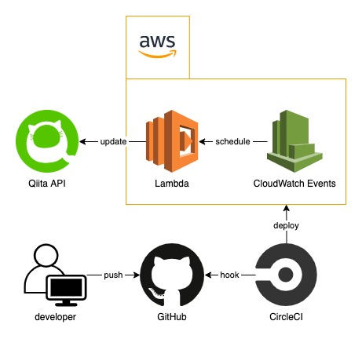

# Qiita LGTM Ranking

Qiita の LGTM ランキング記事を毎日自動更新するシステム。

## デイリーランキング

[Qiita デイリー LGTM 数ランキング](https://qiita.com/items/fa223e1fa0ab057a54bc)

### タグ別

[`AWS`](https://qiita.com/items/8c4aeec4fc98e4b1ba0e)
[`Android`](https://qiita.com/items/9c6bf21a9880e242a0d6)
[`Docker`](https://qiita.com/items/70aa655b580ed4f91756)
[`Git`](https://qiita.com/items/36cfb2318aabe8b3f8df)
[`Go`](https://qiita.com/items/16809f8444e0329bed8a)
[`iOS`](https://qiita.com/items/da7fabcf41ed103528ae)
[`Java`](https://qiita.com/items/9003b8beb47a46292028)
[`JavaScript`](https://qiita.com/items/31e7365a838b890f7cc3)
[`Linux`](https://qiita.com/items/7bcae94b268bff253eef)
[`Node.js`](https://qiita.com/items/17556a2356938fdf489c)
[`PHP`](https://qiita.com/items/42476b629e2d655d9803)
[`Python`](https://qiita.com/items/45e8c5b0017008c62fac)
[`Rails`](https://qiita.com/items/6835d21664b6e36a1efa)
[`React`](https://qiita.com/items/d17e403386f316d0d96e)
[`Ruby`](https://qiita.com/items/effb08232a286c91b814)
[`Swift`](https://qiita.com/items/4b45f7a2308597b362e6)
[`TypeScript`](https://qiita.com/items/3442ef41f83064dafb64)
[`Vim`](https://qiita.com/items/cb67a3dd7a37eee8f8d9)
[`Vue.js`](https://qiita.com/items/a0d7b0334c58e658c7a0)
[`初心者`](https://qiita.com/items/4107350b0914837836af)

## 週間ランキング

[Qiita 週間 LGTM 数ランキング](https://qiita.com/items/b6cfc81906990b3a3e72)

### タグ別

[`AWS`](https://qiita.com/items/e24b6279326a462d456c)
[`Android`](https://qiita.com/items/8b3af051428d746f26c5)
[`Docker`](https://qiita.com/items/ae11fca7d2eba445b037)
[`Go`](https://qiita.com/items/49d4537d95f878b3e91a)
[`Git`](https://qiita.com/items/74eacdbf363e260981c3)
[`iOS`](https://qiita.com/items/e61a29a383d0403e92fc)
[`Java`](https://qiita.com/items/4c3f84836bfdbb137226)
[`JavaScript`](https://qiita.com/items/eaa7ac5b62a0a723edbb)
[`Linux`](https://qiita.com/items/362e81e53c3f9dee22f1)
[`Node.js`](https://qiita.com/items/66ed7ad8f7c9673e9d50)
[`PHP`](https://qiita.com/items/3318cbdbc45c6ebd4014)
[`Python`](https://qiita.com/items/9d7f2ffeafb36cf59a77)
[`Rails`](https://qiita.com/items/93b9e7f7d143e9ce650e)
[`React`](https://qiita.com/items/f9712f8acace22815b99)
[`Ruby`](https://qiita.com/items/72c3d2e896bdc3e1a6b3)
[`Swift`](https://qiita.com/items/e2b6f0645e29f0e2b761)
[`TypeScript`](https://qiita.com/items/25b7c0870afa6d41d19b)
[`Vim`](https://qiita.com/items/f5361177baef95e447d1)
[`Vue.js`](https://qiita.com/items/2774e02c6eea5c830d99)
[`初心者`](https://qiita.com/items/402899ec543aff109505)

# アーキテクチャ図

# LICENSE

[MIT](./LICENSE)
